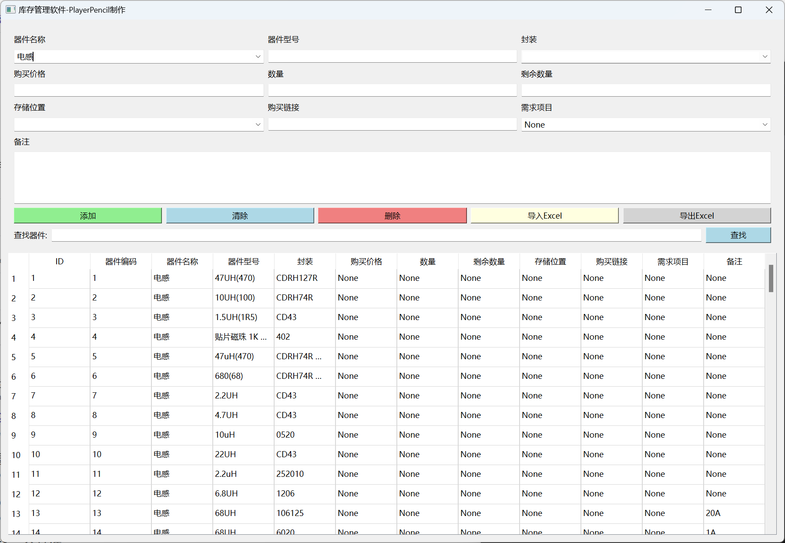

# 面向电子工程师的小型的器件管理软件


## 1. 编写此软件的目的
- 很多工程师在储存自己购买的元器件，尤其是容阻感/电源芯片。。。。等等常用芯片时，用过一次后，就将此放在箱子里。不是忘记存放位置，就是忘记。在下次使用时需重复购买，所以开发了此软件。
- 此软件使用了SQLite数据库，`inventory.db` 为数据库文件，如果不需要默认的数据，删除即可。但切记，不要随便删除此文件，会导致数据丢失。
- 对于器件管理，我创建了如下字段
    ```text
    ID
    器件编号  
    器件名称        -- 建议此项使用器件大类，如电容 电阻 电感 电源芯片等等
    器件型号        -- 如具体型号，如1K 104电容 STM32F103.... 但是建议，电容建议使用统一名称，如100nf或者104电容，不要混合使用。
    封装           -- 封装一定要写清除，如果器件名称and器件型号and封装全部一定，则会被系统查重
    购买价格        -- 用于统计成本
    数据            
    剩余数据        -- 便于检查库存
    存储位置        -- 建议器件储存在方便找到的位置，加上标签。如货架1 或者A1
    购买链接        -- 方便补货
    需要项目        -- 建议填写，在查找时，使用项目进行查找，方便统计器件需求。
    备注            
    ```
## TODO
- [x] 因为python编译出来的代码尺寸非常大，下一步将移植到C++版本的QT进行开发；
    - 已解决，还是使用python，使用干净的环境，更换Pandas库。
    - 编译出来23M，比之前缩小十倍。
- [ ] 添加导入嘉立创BOM表的功能；
- [ ] 添加视频扫描常用标签，进行入库的功能； 